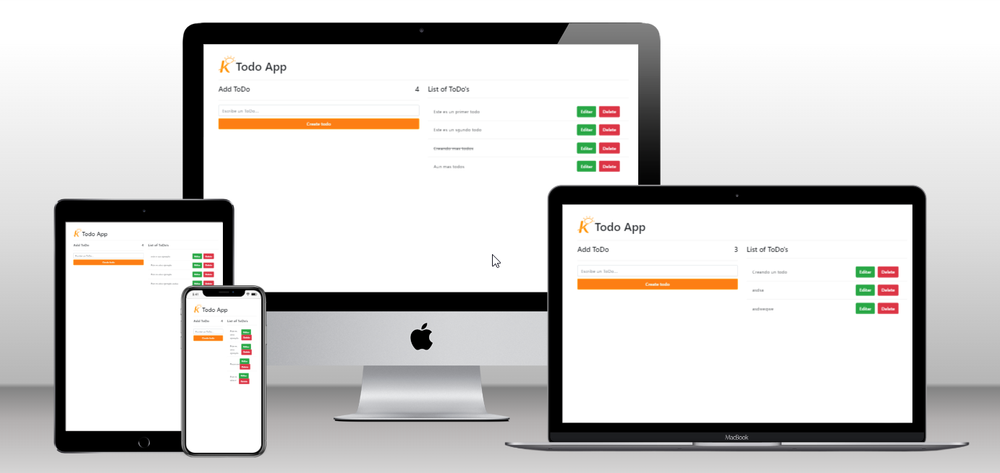

<p align="center">

</p>

<h1 align="center">To do list</h1>

- In this repository you will find an app for creating To do list.



## 🛠 Build With

- ⚛️ React
- 🧱 HTML
- 🎨 CSS
- 🚀 Git

## 🔌Getting Started

**In this repository you will find an adaptation of a To do list made by a youtuber who has a course on Hooks in React.**

## 🚀 Run it

Clone the project

```bash
  git clone https://github.com/eddyjav/to-do-list-kruger.git
```

Go to the project directory

```bash
  cd to-do-list-kruger
```

Install dependencies

```bash
  npm install
```

Start the server

```bash
  npm start
```

## ⚙️ Deployment

For a live demo please visit the following link

https://to-do-list-kruger.vercel.app/

## 👨‍💻 Authors

- [@eddyjav](https://github.com/eddyjav/)

  [](https://github.com/eddyjav)

  [](https://www.linkedin.com/in/javier-yanez-st/)

- [@marcosrivasr](https://github.com/marcosrivasr)

  [](https://github.com/marcosrivasr)

## 📫 Contributing

Contributions are always welcome!

Feel free to check the [issues page.](https://github.com/eddyjav/to-do-list-kruger/issues)

## 👍 Show your support

If you like this project give me a ⭐.

## Acknowledgements

- [Vida MRR](https://www.youtube.com/watch?v=oT-feDPuJmk&t=13187s)
